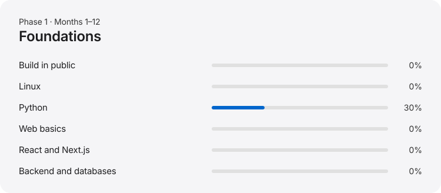
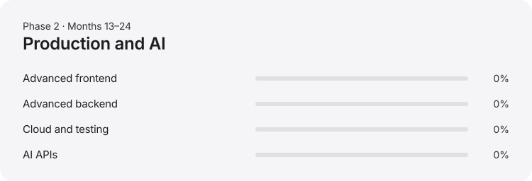
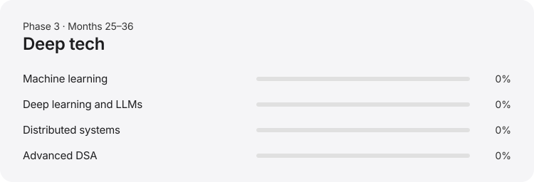
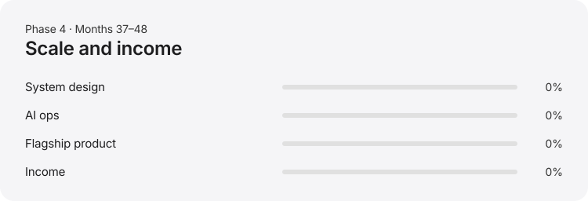

# Roadmap

Four years. From beginner to full-stack, AI and system design.

- **Pace:** 15–20 hours a week. Four years is the plan. Five or six is fine.
- **Breaks:** February and June. Exams first, light revision only.
- **Method:** One skill at a time. Build a project at every step. Share everything in public.

| Phase | Months | Focus |
|:--|:--|:--|
| [1. Foundations](#phase-1-foundations) | 1–12 | Linux, Python, web, React, backend |
| [2. Production and AI](#phase-2-production-and-ai) | 13–24 | Advanced web, cloud, AI APIs |
| [3. Deep tech](#phase-3-deep-tech) | 25–36 | Machine learning, distributed systems, DSA |
| [4. Scale and income](#phase-4-scale-and-income) | 37–48 | System design, AI ops, flagship product, income |

## Phase 1: Foundations

Months 1–12. A strong base in code, Linux and the web.

### Build in public

Week 1, then always.

- Push every project to GitHub, even small scripts.
- Post learning notes on [Hashnode](https://hashnode.com/) or [Dev.to](https://dev.to/).
- Share progress weekly on LinkedIn, Twitter or Reddit.
- Join [r/webdev](https://www.reddit.com/r/webdev/), [Stack Overflow](https://stackoverflow.com/) and [Discord dev communities](https://discord.com/discover).
- Start open source small: typo fixes, docs.

**Build:** Blog post "Week 1: My road to full-stack and AI".

### Linux

Weeks 1–4. Full path in [Linux](../Skills/Linux.md).

- Install [Ubuntu](https://ubuntu.com), [Linux Mint](https://linuxmint.com) or [Fedora](https://getfedora.org).
- Commands, file system, text tools.
- Users, permissions, packages.
- Shell scripting basics.

**Learn:** [Linux for Absolute Beginners (Udemy)](https://www.udemy.com/course/linux-for-absolute-beginners/) · [Linux Tutorial for Beginners (freeCodeCamp)](https://www.youtube.com/watch?v=sWbUDq4S6Y8)

**Build:** Shell script that automates backups.

### Python

Weeks 5–12. Full path in [Python](../Skills/Python.md).

- Variables, types, loops, functions, OOP.
- Built-in data structures: `list`, `dict`, `set`.
- Files, modules, virtual environments.
- CLI scripts on Linux.

**Learn:** [100 Days of Code: Python Pro Bootcamp (Udemy)](https://www.udemy.com/course/100-days-of-code/) · [Python for Everybody (Coursera)](https://www.coursera.org/specializations/python) · [Python for Beginners (freeCodeCamp)](https://youtu.be/rfscVS0vtbw)

**Build:** CLI task manager with file storage. Publish it and blog about it.

**Also build:** Snake game with Pygame.

### Web basics

Months 4–6.

- HTML, CSS, JavaScript.
- DOM, responsive design, Flexbox, Grid.
- Git and GitHub.

**Learn:** [The Complete Web Development Bootcamp (Udemy)](https://www.udemy.com/course/the-complete-web-development-bootcamp/) · [Responsive Web Design (freeCodeCamp)](https://www.freecodecamp.org/learn/) · [JavaScript Full Course (freeCodeCamp)](https://youtu.be/PkZNo7MFNFg)

**Build:** Portfolio website. Deploy it and write a showcase post.

### React and Next.js

Months 7–9.

- React: components, props, state, hooks.
- Next.js: pages, routing, API routes.
- State: Context API or Redux basics.

**Learn:** [React Full Course (freeCodeCamp)](https://www.youtube.com/watch?v=bMknfKXIFA8) · [React JS Crash Course (Traversy Media)](https://youtu.be/w7ejDZ8SWv8) · [React: The Complete Guide (Udemy)](https://www.udemy.com/course/react-the-complete-guide-incl-redux/) · [Next.js & React: The Complete Guide (Udemy)](https://www.udemy.com/course/nextjs-react-the-complete-guide/) · [Fireship (YouTube)](https://www.youtube.com/c/Fireship)

**Build:** Blog with Next.js and Markdown. Write "How I built my blog with Next.js".

### Backend and databases

Months 10–12.

- Node.js and Express.
- REST API design.
- PostgreSQL with Prisma ORM.
- Docker basics. Deploy to Railway or Render.

**Learn:** [Node.js, Express, MongoDB Bootcamp (Udemy)](https://www.udemy.com/course/nodejs-express-mongodb-bootcamp/) · [Docker Crash Course (Fireship)](https://youtu.be/3c-iBn73dDE) · [PostgreSQL Full Course (freeCodeCamp)](https://youtu.be/qw--VYLpxG4) · [TechWorld with Nana (YouTube)](https://www.youtube.com/c/TechWorldwithNana)

**Build:** Real-time chat app with WebSocket, Node.js and PostgreSQL. Add a demo video and a README.

**Also build:** REST API for an online store · Blog platform with login.

### Done when

- [ ] 5–7 beginner projects on GitHub
- [ ] Blog and social profiles active
- [ ] Comfortable with Python, Linux and web basics
- [ ] First full-stack app deployed

## Phase 2: Production and AI

Months 13–24. Scalable, production-ready apps with AI features.

### Advanced frontend

Months 13–15.

- Next.js server components and data fetching.
- Tailwind CSS.
- Auth: NextAuth.js, JWT, OAuth2.

**Learn:** [Next.js & React: The Complete Guide (Udemy)](https://www.udemy.com/course/nextjs-react-the-complete-guide/) · [Tailwind CSS Crash Course (Traversy Media)](https://youtu.be/dFgzHOX84xQ)

**Build:** Online store UI with Next.js and Tailwind.

**Also build:** AI-powered blog platform.

### Advanced backend

Months 16–18.

- NestJS or advanced Express.
- GraphQL and resolvers.
- Role-based access control, API security.

**Learn:** [NestJS Zero to Hero (Udemy)](https://www.udemy.com/course/nestjs-zero-to-hero/) · [GraphQL Crash Course (Traversy Media)](https://youtu.be/BcLNfwF04Kw)

**Build:** Online store backend with NestJS and PostgreSQL.

**Also build:** MERN social media app.

### Cloud and testing

Months 19–21.

- AWS or GCP basics.
- Kubernetes basics.
- Tests with Jest and Playwright.
- CI/CD with GitHub Actions.

**Learn:** [Introduction to AWS (Udemy)](https://www.udemy.com/course/awsintro/) · [GCP Fundamentals: Core Infrastructure (Udemy)](https://www.udemy.com/course/google-cloud-fundamental-knowledge/) · [Google Cloud Fundamentals (Coursera)](https://www.coursera.org/learn/gcp-fundamentals) · [Docker & Kubernetes: The Practical Guide (Udemy)](https://www.udemy.com/course/docker-kubernetes-the-practical-guide/) · [Kubernetes (TechWorld with Nana)](https://youtu.be/X48VuDVv0do) · [Testing JavaScript with Jest (Udemy)](https://www.udemy.com/course/testing-javascript-with-jest/)

**Build:** Deploy the online store to the cloud.

### AI APIs

Months 22–24.

- OpenAI API.
- LangChain for LLM apps.
- Vector databases: pgvector, Pinecone.

**Learn:** [OpenAI API & ChatGPT API for Developers (Udemy)](https://www.udemy.com/course/introduction-to-openai-api-chatgpt-api-chatgpt-plugins/) · [GenAI Apps with LangChain & Pinecone (Udemy)](https://www.udemy.com/course/master-langchain-pinecone-openai-build-llm-applications/) · [Intro to OpenAI API (freeCodeCamp)](https://youtu.be/2FeymQoKvrk) · [LangChain Crash Course](https://youtu.be/MlK6SIjcjE8)

**Build:** AI code reviewer bot with LangChain and the GitHub API.

**Also build:** AI command-line assistant · AI knowledge search app.

### Done when

- [ ] Production-ready frontend and backend
- [ ] Apps running in the cloud
- [ ] First AI app in the portfolio
- [ ] Real code merged in 2+ open-source projects

## Phase 3: Deep tech

Months 25–36. Custom AI models, distributed systems, strong problem solving.

### Machine learning

Months 25–27.

- Data cleaning, preprocessing, visualization.
- Supervised and unsupervised learning.
- Training, evaluation, tuning.

**Learn:** [Machine Learning, Andrew Ng (Coursera)](https://www.coursera.org/learn/machine-learning) · [Data Science Crash Course (freeCodeCamp)](https://youtu.be/ua-CiDNNj30) · [Python for Data Science: NumPy, Pandas, Scikit-Learn (Udemy)](https://www.udemy.com/course/python-for-data-science-numpy-pandas-scikit-learn/), 330+ exercises

**Build:** Recommendation system for movies or products.

**Also build:** Stock price prediction model.

### Deep learning and LLMs

Months 28–30.

- Neural network basics.
- Transfer learning and fine-tuning.
- Custom LLMs with Hugging Face Transformers.

**Learn:** [Deep Learning Specialization, Andrew Ng (Coursera)](https://www.coursera.org/specializations/deep-learning) · [Hugging Face Course](https://huggingface.co/course/) · [PyTorch: Deep Learning and AI (Udemy)](https://www.udemy.com/course/pytorch-deep-learning/), updated August 2025 · [Transformer Models and LLM Fine-Tuning (Udemy)](https://www.udemy.com/course/fine-tuning-llm-with-hugging-face-transformers/) · [Sentdex (YouTube)](https://www.youtube.com/user/sentdex)

**Build:** Chatbot with memory on a fine-tuned LLM.

### Distributed systems

Months 31–33.

- Event-driven architecture.
- Kafka streaming, RabbitMQ.
- Sharding and replication.

**Learn:** [Kafka Crash Course (Conduktor)](https://youtu.be/98Q3f8vIdl0) · [Distributed Systems (MIT OCW)](https://ocw.mit.edu/courses/electrical-engineering-and-computer-science/6-824-distributed-computer-systems-engineering-spring-2006/) · [Learn Apache Kafka for Beginners v3 (Udemy)](https://www.udemy.com/course/apache-kafka/) · [Kafka for Spring Boot Microservices (Udemy)](https://www.udemy.com/course/apache-kafka-for-spring-boot-microservices/) · [Event-Driven Architecture (Udemy)](https://www.udemy.com/course/event-driven-architecture-the-complete-guide/)

**Build:** Distributed video processing system.

### Advanced DSA

Months 34–36. Full path in [DSA](../Skills/DSA.md).

- Arrays, strings, trees, graphs, dynamic programming.
- Data structures from scratch in Python or C.
- 150+ medium and hard LeetCode problems.

**Learn:** [Master the Coding Interview: DSA (Udemy)](https://www.udemy.com/course/master-the-coding-interview-data-structures-algorithms/) · [CP Handbook](https://cses.fi/book/book.pdf) · [Striver's DSA Sheet](https://takeuforward.org/) · [Data Structures and Algorithms, UC San Diego (Coursera)](https://www.coursera.org/specializations/data-structures-algorithms)

**Build:** Pathfinding visualizer or search indexing engine.

### Done when

- [ ] AI models and fine-tuned LLMs built
- [ ] 3 documented AI/ML projects on GitHub
- [ ] A distributed system designed and deployed
- [ ] 200+ DSA problems, mock interviews done, resume ready

## Phase 4: Scale and income

Months 37–48. Work at tech-lead level. Launch a flagship. Earn from your skills.

### System design

Months 37–39.

- Design for millions of users.
- Load balancing, caching, API gateways, microservices.
- Scalability, availability, fault tolerance.

**Learn:** [System Design Interview (Udemy)](https://www.udemy.com/course/system-design-interview/) · [System Design Primer (GitHub)](https://github.com/donnemartin/system-design-primer) · [System Design Primer talk (GOTO)](https://youtu.be/UzLMhqg3_Wc) · [System Design playlist (Tech Dummies)](https://youtube.com/playlist?list=PLTCrU9sGyburBw9wNOHebv9SjlE4Elv5a) · [Cloud Computing Specialization, Illinois (Coursera)](https://www.coursera.org/specializations/cloud-computing)

**Build:** Scalable social media platform.

**Also build:** Microservices online store · ML models on AWS with Docker and Kubernetes.

### AI ops

Months 40–42.

- Model monitoring and retraining.
- MLflow, DVC.
- Terraform, Kubernetes deployment.
- Secure model pipelines.

**Learn:** [MLOps Fundamentals (Udemy)](https://www.udemy.com/course/mlops-fundamentals/) · [AI Deployment & Monitoring (YouTube)](https://youtu.be/_VUm2J1EecY) · [MLflow Tutorial (freeCodeCamp)](https://youtu.be/7PqA0bPnrK0)

**Build:** AI chatbot with a monitoring dashboard.

### Flagship product

Months 43–45.

- One large, production-ready product. SaaS or open source.
- Full docs, CI/CD, tests, marketing site.
- Ideas: AI developer agent, AI productivity platform, developer automation tool.

**Build:** Launch the MVP. Collect feedback. Iterate to market fit.

### Income

Months 46–48. All ideas in [Income](../Money/Income.md).

- Now: freelance and consulting ($100–200/hour), technical writing, code reviews and mentoring on Codementor, bug bounties.
- Later: digital products, online courses, micro SaaS, open-source sponsors.

**Build:** Personal brand site with live project demos, plus one paid product.

### Also learn

- **Leadership:** Agile and Scrum. [Agile Project Management (freeCodeCamp)](https://youtu.be/Z9QbYZh1YXY). Lead a small open-source team.
- **Security:** Pen-testing basics. [The Complete Cyber Security Course (Udemy)](https://www.udemy.com/course/the-complete-internet-security-privacy-course-volume-1/). Build a secure API gateway.
- **Startups:** [YC Startup School](https://www.startupschool.org/). Launch an open-source community tool.
- **Business:** Product management, marketing and SEO, pricing and taxes.
- **Presence:** Weekly posts, talks (local, then regional, then international), podcasts, YouTube, a newsletter, mentoring, workshops.

### Done when

- [ ] Systems designed and deployed at scale
- [ ] Flagship SaaS or open-source product launched
- [ ] Several income streams from tech skills
- [ ] Known in the developer community

## Choose a focus

You can't master everything equally. Pick one main path by month 18.

| Path | Main | Also | Career |
|:--|:--|:--|:--|
| Full-stack | Advanced web, system design, DevOps | AI integration | Senior engineer, tech lead, engineering manager |
| AI/ML | ML, deep learning, MLOps | Full-stack to ship AI products | ML engineer, senior AI engineer, AI research or CTO |
| Platform | Infrastructure, distributed systems, cloud | Full-stack, AI ops | Platform engineer, staff engineer, principal engineer |

### Months 19–30 by path

**Full-stack**
- 19–24: Microservices, service mesh, API gateways, Kubernetes and Helm, logging, metrics, tracing, OAuth2/OIDC, security scans. Build a multi-tenant SaaS with real-time features and monitoring.
- 25–30: Code splitting, lazy loading, CDN, caching, database tuning, auto-scaling, disaster recovery, APM and SLAs. Build an app for 10k+ concurrent users: under 100 ms, 99.9% uptime, global CDN.

**AI/ML**
- 19–24: Probability, statistics, linear algebra, ensembles, CNNs, RNNs, Transformers, ETL, feature engineering. Read [Hands-On Machine Learning](https://www.oreilly.com/library/view/hands-on-machine-learning/9781098125967/), [Practical Deep Learning (fast.ai)](https://course.fast.ai/), [Pattern Recognition and Machine Learning (Bishop)](https://www.microsoft.com/en-us/research/people/cmbishop/prml-book/). Build an end-to-end ML pipeline with A/B tests and a production deploy.
- 25–30: Model versioning, continuous training, fine-tuning, RAG, prompt engineering, model serving, bias and robustness checks. Build a production AI app with a fine-tuned LLM, RAG and a real-time inference API.

**Platform**
- 19–24: Terraform, CloudFormation, Istio, Envoy, IAM, secrets, compliance, cost tracking. Build a multi-cloud platform with disaster recovery and auto-scaling.
- 25–30: Raft, Byzantine fault tolerance, Kafka, event sourcing, CQRS, CAP theorem, eventual consistency. Build a multi-region streaming data platform that heals itself.

### Flagship ideas

| Path | Ideas |
|:--|:--|
| Full-stack | Developer platform like GitHub · Collaboration suite like Notion or Figma · Store platform like Shopify |
| AI/ML | AI coding assistant · AutoML platform like H2O.ai · AI agent for law, health or finance |
| Platform | Multi-cloud orchestration like Terraform Cloud · Developer platform like Vercel or Netlify · Monitoring suite like Datadog |

A flagship has 10,000+ lines, full docs, 90%+ test coverage, CI/CD, monitoring and alerts, a security audit, benchmarks and real user feedback.

### Career paths

- **Technical:** staff, principal, distinguished engineer.
- **Management:** tech lead, engineering manager, VP of engineering.
- **Founder:** technical co-founder, CTO, CEO.
- **Teaching:** consultant, course creator, technical advisor.
- **Research:** applied research, technical writing, thought leader.

## Go deeper

Books, courses and projects beyond the main plan.

**Linux.** Shell automation, system admin, processes, networking, packages, security.
- Read: [Linux Command Line and Shell Scripting Bible](https://www.wiley.com/en-us/Linux+Command+Line+and+Shell+Scripting+Bible%2C+4th+Edition-p-9781119700913) · [Linux for Developers (Udemy)](https://www.udemy.com/course/linux-for-developers/)
- Build: system monitor, backups with rotation, log analyzer.

**Programming.** Python OOP, functional and async. JavaScript ES6+, closures, prototypes, async.
- Read: [Fluent Python](https://www.oreilly.com/library/view/fluent-python-2nd/9781492056348/) · [JavaScript: The Hard Parts](https://frontendmasters.com/courses/javascript-hard-parts/)
- Build: CLI task manager with SQLite, web scraper with rate limits, 2D canvas game engine.

**Computer science.** Data structures, algorithms, Big O, scalability trade-offs.
- Read: [Introduction to Algorithms (CLRS)](https://mitpress.mit.edu/9780262046305/introduction-to-algorithms/) · [Algorithms Specialization, Stanford (Coursera)](https://www.coursera.org/specializations/algorithms)
- Build: algorithm visualizer, B-tree database, A* and Dijkstra simulator.

**Frontend.** React performance, TypeScript generics, SSR and SSG, Redux Toolkit, Zustand, React Query, Playwright.
- Read: [Learning React](https://www.oreilly.com/library/view/learning-react-2nd/9781492051718/) · [Epic React](https://epicreact.dev/)
- Build: component library on npm with Storybook, real-time collaboration app, large-data dashboard.

**Backend.** REST, GraphQL, OpenAPI, indexing, query tuning, OAuth2, RBAC, contract tests.
- Read: [Node.js Design Patterns](https://www.packtpub.com/product/nodejs-design-patterns-third-edition/9781839214110) · [The Complete Node.js Developer (Udemy)](https://www.udemy.com/course/the-complete-nodejs-developer-course-2/)
- Build: event-driven microservices store, API gateway with rate limits, real-time analytics.

**Networks and systems.** TCP/UDP sockets, HTTP internals, threads, async I/O, memory, encryption.
- Read: [Computer Networking: A Top-Down Approach](https://gaia.cs.umass.edu/kurose_ross/index.php) · [System Programming, Illinois](https://github.com/angrave/SystemProgramming/wiki)
- Build: multi-threaded HTTP server, encrypted P2P chat, load balancer with health checks.

**Databases.** B-trees, LSM trees, WAL, MVCC, query plans, replication, sharding, NoSQL.
- Read: [Designing Data-Intensive Applications](https://dataintensive.net/) · [Database Systems (CMU)](https://15445.courses.cs.cmu.edu/fall2022/)
- Build: SQL query engine, distributed key-value store, migration tool.

**System design.** Design Twitter, WhatsApp, Netflix. Trade-offs, capacity planning, failure modes.
- Read: [System Design Interview Vol. 1 & 2](https://www.amazon.com/System-Design-Interview-insiders-Second/dp/B08CMF2CQF) · [Grokking the System Design Interview](https://www.educative.io/courses/grokking-the-system-design-interview)
- Practice: one design challenge a week, with peer review.

**Algorithms.** Segment trees, tries, network flow, matching, linear programming.
- Target: 300+ LeetCode problems, 150+ medium, 100+ hard.

## Targets

**By month 48**
- 20+ production projects
- Full-stack, AI/ML, distributed systems and system design skills
- Strong Linux and DSA for interviews
- Several income streams
- A known voice in your niche

**By month 18**
- [ ] 20+ blog posts
- [ ] 15+ projects with good READMEs
- [ ] 5+ open-source contributions
- [ ] Active in 3+ developer communities
- [ ] 100+ relevant LinkedIn connections
- [ ] AWS Cloud Practitioner or similar

**Year 6 and beyond**
- [ ] 30+ production projects, 2,000+ commits, 1,000+ GitHub stars
- [ ] 100+ technical posts, 5,000+ Stack Overflow reputation
- [ ] 3+ cloud or specialty certifications
- [ ] 90%+ test coverage, sub-second responses, 10k+ concurrent users, zero critical vulnerabilities
- [ ] Salary 3x the starting point, $150k+ total income
- [ ] Conference speaker, 500+ connections, 10+ developers mentored
- [ ] Leading technical work, a patent or major open-source contribution
- [ ] 3+ income streams, $2,000+/month passive, 5+ consulting clients, $2,500+ per talk

## Rules

- Add 25% buffer to every estimate.
- Review every 6 months. Reset goals every 12 months. Check skill gaps before each phase.
- Keep spare weeks for emergencies and revision.
- Take breaks between hard blocks. Check balance every quarter. Watch for burnout.
- Keep peers, mentors and an accountability partner close.
- Review the market every quarter. Update the stack as tools change.
- Change course if your interests or the market change.

This is a guide, not a contract. Steady progress and real projects matter most.
